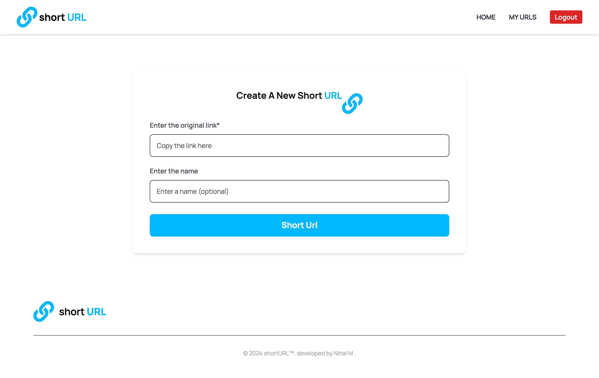

# ShortURL

ShortURL is a web application developed using React, Node.js, and MongoDB. It allows users to shorten URLs into 8-character length links, which redirect to the original URL. The application features JWT authentication for user login and signup.

## Features

- JWT authentication for user login and signup
- URL shortening to 8-character length links
- Listing all shorted URLs
- Redirection to original URLs
- Delete the shorted URLs

## Technologies Used


## Getting Started

To get started with ShortURL, follow these steps:

1. **Clone the repository:**

   ```bash
   git clone https://github.com/MNihal7961/Url-shortner.git
   ```

2. **Setup Environment:**

   - Create a `.env` file in the `server` directory for server-related environment variables.

   - Example `.env` files:
     ```dotenv
     # Server .env
     PORT=4000
     MONGO_URL="Your Mongo Url"
     JWT_SECRET="Your JWT Secret"
     ```

3. **Install Dependencies and Run Development Servers:**
   - **Client:**
     ```bash
     cd client
     npm install
     npm run dev
     ```
   - **Server:**
     ```bash
     cd server
     npm install
     npm run dev
     ```

## Usage

To use the website:

1. Create an account or login to your account.
2. Paste a URL into the input field provided.
3. Optionally, provide a custom name for your shortened URL.
4. Click on the "Shorten" button.
5. Your URL will be shortened, and you can use the generated link to redirect to the original URL.
6. Go to your shortened URL, then access any URL you want.

## Preview



## Contribution

Contributions are welcome! Feel free to submit issues and pull requests.

## License

This project is licensed under the [MIT License](LICENSE).
